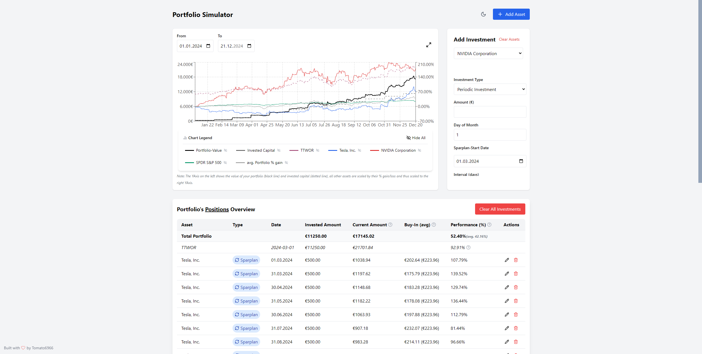

# Investment Portfolio Simulator

A modern web application for simulating and tracking investment portfolios with real-time data. Built with React, TypeScript, and Tailwind CSS.

Why this Project?
- I wanted to see how my portfolio would perform if I had invested in something else, and thus with savings plan(s)
- The main issue with other saving-plan calculators is, that they calculate based on the p.a. performance, i wanted further insights however, and thus this projected was created.
- It allows you to see how single-investments and savings plans would have performed, and how they would have affected your portfolio.
- There are multiple indicators and design choices made:
  - TTWOR (Time Travel Without Risk) calculations
  - Average Portfolio Performance
  - Portfolio Performance & Value
  - All assets (except the TTWOR and Portfolio-Value) are scaled by percentage of their price. Thus their referenced, scale is on the right. The referenced scale on the left is only for the portfolio-value

## Features

- 📈 Real-time stock data from Yahoo Finance
- 💰 Track multiple assets and investments
- 📊 Interactive charts with performance visualization
- 🌓 Dark/Light mode support
- 📱 Responsive design
- 📅 Historical data analysis
- 💹 TTWOR (Time Travel Without Risk) calculations
- 🔄 Support for one-time and periodic investments
- 📊 Detailed performance metrics

## Tech Stack

- React 18
- TypeScript
- Tailwind CSS
- Vite
- Recharts
- date-fns
- Lucide Icons

## Self Hosting

### Prerequisites

- Node.js 20 or higher
- npm or yarn

### Local Development

1. Clone the repository
