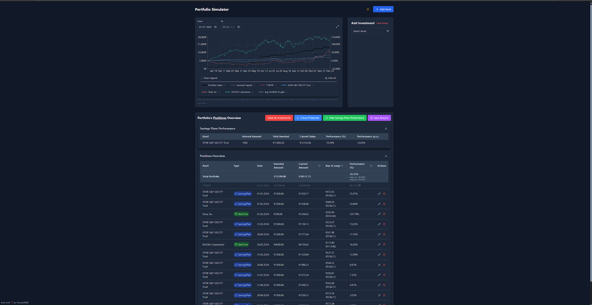
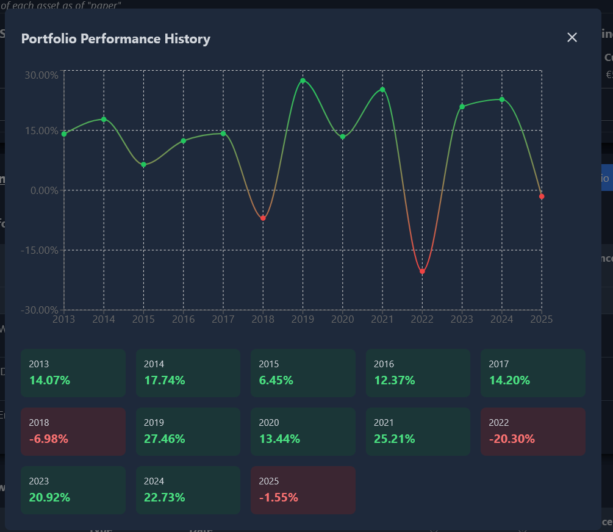

# Investment Portfolio Simulator

A modern web application for simulating and tracking investment portfolios with real-time data. Built with React, TypeScript, and Tailwind CSS.

Why this Project?
- I wanted to see how my portfolio would perform if I had invested in something else, and thus with savings plan(s)
- The main issue with other saving-plan calculators is, that they calculate based on the p.a. performance, i wanted further insights however, and thus this projected was created.
- It allows you to see how single-investments and savings plans would have performed, and how they would have affected your portfolio.
- There are multiple indicators and design choices made:
  - TTWOR (Time Travel Without Risk) calculations
  - Average Portfolio Performance
  - Portfolio Performance & Value
  - All assets (except the TTWOR and Portfolio-Value) are scaled by percentage of their price. Thus their referenced, scale is on the right. The referenced scale on the left is only for the portfolio-value

https://github.com/user-attachments/assets/4507e102-8dfb-4614-b2ba-938e20e3d97b

## Features

- 📈 Real-time stock data from Yahoo Finance
- 💰 Track multiple assets and investments
- 📊 Interactive charts with performance visualization
- 🌓 Dark/Light mode support
- 📱 Responsive design
    - *Mobile friendly*
- 📅 Historical data analysis
    - *The portfolio is fully based on real-historical data, with configurable timeranges*
- 💹 TTWOR (Time Travel Without Risk) calculations
    - *Including metrics for TTWOR*
- 🔄 Support for one-time and periodic investments
    - *You can config your dream-portfolio by one time and periodic investments easily*
- 📊 Detailed performance metrics
    - *See all needed performance metrics in one place*
- 📅 Future Projection with Withdrawal Analysis and Sustainability Analysis
    - *Generate a future projection based on the current portfolio performance, with a withdrawal analysis and sustainability analysis + calculator*
    - *Including with best, worst and average case scenarios*
- 📊 Savings Plan Performance Overview Tables
    - *See the performance of your savings plans if you have multiple assets to compare them*
- 📄 Export to PDF
    - *Export the entire portfolio Overview to a PDF, including Future Projections of 10, 15, 20, 30 and 40 years*
- 📄 Export to CSV Tables
    - *Export all available tables to CSV*
- See the asset performance p.a. as well as of the portfolio

## Tech Stack

- React 19
- TypeScript
- Tailwind CSS
- Vite@6
- Recharts
- date-fns
- Lucide Icons

## Self Hosting

### Prerequisites

- Node.js & npm 20 or higher

### Local Development

1. Clone the repository
2. Run `npm install`
3. Run `npm run dev` -> developer preview
  - Run `npm run build` -> build for production (dist folder) (you can then launch it with dockerfile or with a static file server like nginx)
  - Run `npm run preview` -> preview the production build (dist folder)

### Credits:

> Thanks to [yahoofinance](https://finance.yahoo.com/) for the stock data.

- **15.01.2025:** Increased Performance of entire Site by utilizing Maps
